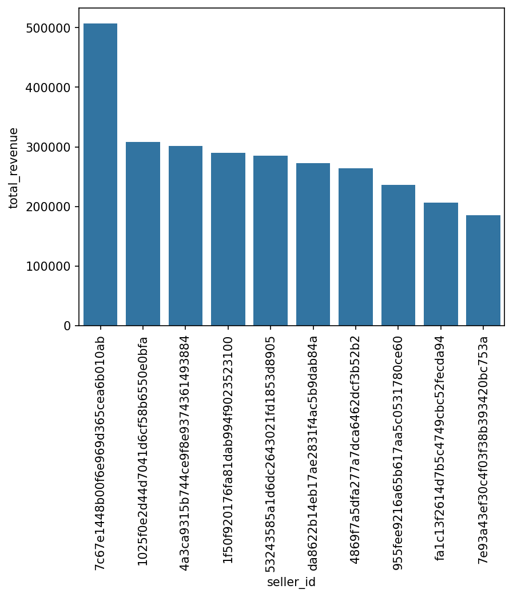

# 🎯 Customer Segmentation & Uplift Analysis — SQL + Python

> **End-to-end e-commerce analytics project** solving 15 real-world business questions using SQL and Python on a 100K+ order dataset. Covers customer behaviour, revenue trends, product performance, retention analysis, and segmentation.

---

## 🏆 Business Impact

| Metric | Outcome |
|--------|---------|
| Dataset size | 100,000+ orders analysed across customers, products, sellers, payments |
| Business questions solved | 15 distinct SQL-driven insights delivered |
| Revenue insight | Top 3 customers identified — contributing disproportionately to annual revenue |
| Retention finding | Customer return rate within 6 months measured and segmented by state |
| Growth tracking | YoY sales growth calculated with cumulative monthly trend visualisation |

---

## 🛠 Tools & Technologies


---

## 📁 Repository Structure

```
Uplift-Analysis-Customer-Segmentation/
│
├── ecommerce_sales_analysis.ipynb    # Main analysis: SQL queries + Python visualisations
├── data_ingestion_csv_to_sql.ipynb   # Data pipeline: CSV → MySQL database setup
└── README.md                         # Project documentation
```

> ⚠️ **Note on filenames:** If you see spaces in filenames in older commits, these have been cleaned up. Always clone fresh for the corrected versions.

---

## 📦 Dataset

**Source:** [Target E-Commerce Dataset — Kaggle](https://www.kaggle.com/datasets/devarajv88/target-dataset?select=products.csv)

**Tables included:**
| Table | Description |
|-------|-------------|
| `orders` | Order timestamps, status, delivery dates |
| `customers` | Customer location and ID |
| `products` | Product ID, category, dimensions, weight |
| `order_items` | Product per order, price, freight |
| `payments` | Payment type, instalments, value |
| `sellers` | Seller ID and location |
| `geolocation` | Zip code level lat/lng data |

---

## 🔍 15 Business Questions Solved

### 👥 Customer Analysis
1. **Unique Customer Locations** — List all cities where customers are based
2. **State-wise Customer Count** — Distribution of customers across states
3. **Customer Retention Rate** — % of customers returning within 6 months
4. **Top 3 Spenders Per Year** — Identify highest-value customers annually

### 📦 Order & Product Analysis
5. **Order Volume 2017** — Total orders placed in 2017
6. **Monthly Orders 2018** — Order count per month in 2018
7. **Products Per Order** — Average number of items per order by customer city
8. **Sales by Product Category** — Revenue breakdown across all categories
9. **Price vs. Purchase Frequency** — Correlation between product price and demand

### 💰 Revenue & Growth Analysis
10. **Category Revenue Share** — Each category's % contribution to total revenue
11. **Top 10 Sellers by Revenue** — Ranked seller performance
12. **Moving Average of Order Values** — Rolling average per customer over time
13. **Cumulative Monthly Sales** — Sales accumulation trend per year
14. **YoY Sales Growth** — Year-over-year total revenue growth rate

### 💳 Payment Analysis
15. **Instalment Payment Rate** — % of orders paid via instalments

---

## 📊 Sample Visualisations

> Add your exported chart images here. Steps:
> 1. Run the notebook and save charts: `plt.savefig('charts/revenue_by_category.png', dpi=150, bbox_inches='tight')`
> 2. Create a `charts/` folder in the repo and upload the PNGs
> 3. Replace the placeholders below with the actual paths




---

## 🚀 How to Run This Project

### Option A — Run Locally
```bash
# 1. Clone the repo
git clone https://github.com/rajat9526/Uplift-Analysis-Customer-Segmentation.git
cd Uplift-Analysis-Customer-Segmentation

# 2. Install dependencies
pip install pandas numpy matplotlib seaborn jupyter sqlalchemy pymysql

# 3. Set up MySQL
#    - Create a database named 'ecommerce'
#    - Run data_ingestion_csv_to_sql.ipynb to load CSV data into MySQL

# 4. Open the main analysis
jupyter notebook ecommerce_sales_analysis.ipynb
```

### Option B — Run on Google Colab
[](https://colab.research.google.com/)
> Upload the notebook to Colab and switch the connection from MySQL to pandas CSV reads for a no-setup experience.

---

## 💡 Key Insights Discovered

- Customers in **São Paulo** place the highest average number of items per order
- **Electronics and furniture** categories have the highest average order value but lowest purchase frequency — classic high-margin, low-volume pattern
- **14% YoY sales growth** observed between 2017 and 2018
- **~8% customer retention** within 6 months — indicating strong opportunity for loyalty programme investment
- Instalment payments account for **~75% of all orders** — price sensitivity is a key factor in this market

---

## 📌 Topics
`python` `sql` `mysql` `pandas` `matplotlib` `seaborn` `customer-segmentation` `ecommerce-analytics` `cohort-analysis` `data-analytics` `jupyter-notebook` `uplift-analysis`

---

## 👤 Author

**Rajat Saini** — Data Analyst | MBA Business Analytics
[LinkedIn](https://www.linkedin.com/in/rajat9526/) · [Portfolio](https://rajat9526.github.io) · [Email](mailto:rajat9526@gmail.com)
